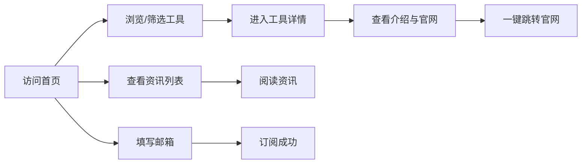
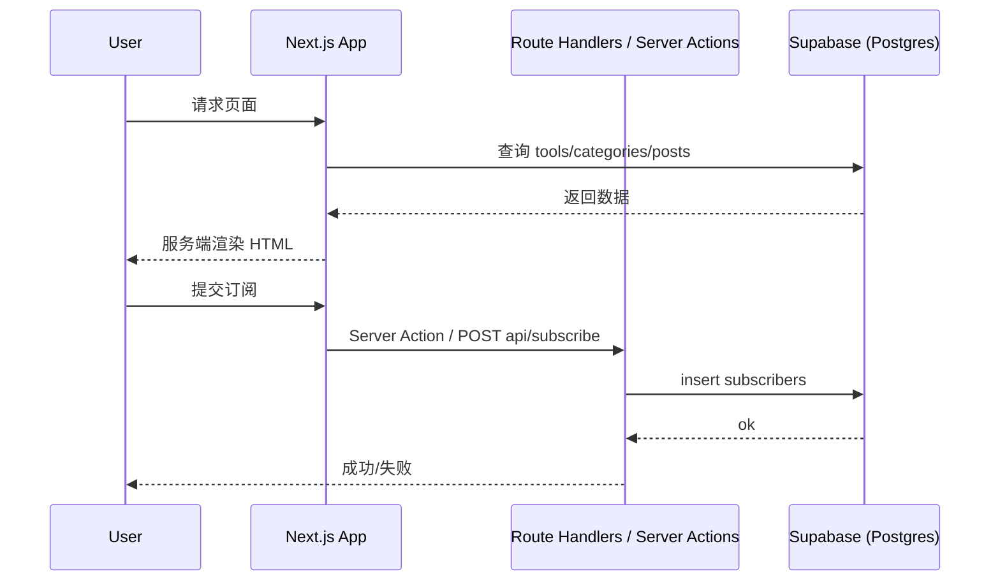

# AI 工具导航网站（AI Tools Directory）完整开发计划

---

## 1. PRD（产品需求文档）

### 产品定位

- **一句话**：面向 AI 使用者的工具导航与资讯站，帮助用户发现、对比、订阅 AI 工具动态。
- **差异化**：聚合介绍 + 优缺点 + 价格 + 场景 + 一键跳转 + 持续资讯 + 邮件订阅，为后续会员/付费/affiliate 预留能力。

### 用户画像


| 角色         | 目标         | 关键行为              |
| ---------- | ---------- | ----------------- |
| AI 独立开发者   | 找可集成/可对标工具 | 按分类/标签筛选、看价格与 API |
| 效率学习者      | 入门与选型      | 看介绍、优缺点、使用场景      |
| 程序员/学生/副业者 | 自动化重复工作    | 按场景筛选、订阅新工具资讯     |


### 核心痛点

- 工具分散，难以系统对比（介绍、优缺点、价格、场景）。
- 新工具更新快，缺少「订阅更新」入口。
- 缺少「一键到官网」的聚合入口，后期需支持变现（会员/affiliate）。

### MVP 功能列表（必须做）

- **工具库**：工具列表（支持分类/标签筛选）、工具详情（介绍、优缺点、价格、使用场景、官网链接）。
- **分类与标签**：预置分类（如：写作、编程、图像、语音等）+ 多标签。
- **首页**：精选/最新工具展示、分类入口、简单 SEO 文案。
- **资讯/动态**：简单「新工具/更新」列表页（标题、摘要、时间、可选详情）。
- **订阅**：邮件订阅（收集 email，记录订阅时间；暂不发报，仅存库）。
- **SEO**：每页可配置 title/description，列表与详情页 SSR，sitemap + 基础 meta。
- **部署**：Vercel 部署可访问。

### V1/V2 扩展（以后再做）

- **V1**：邮件推送（如每周摘要）、搜索（站内工具+资讯）、评论/评分、简单后台（工具/资讯 CRUD）、affiliate 链接与统计。
- **V2**：会员体系、付费内容/专题、多语言(i18n)、API 开放、数据看板。

### 用户使用流程（MVP）




---

## 2. 系统架构设计

### 技术栈说明与选型理由


| 层级     | 技术选型                                        | 理由                                                                                |
| ------ | ------------------------------------------- | --------------------------------------------------------------------------------- |
| 前端框架   | Next.js 16 (App Router)                     | 已具备；SSR/SSG 支持 SEO，API Routes 可做 BFF，Vercel 原生支持。                                 |
| 语言     | TypeScript                                  | 类型安全、可维护、工业级标配。                                                                   |
| 样式     | TailwindCSS v4                              | 已具备；原子类、设计一致、构建体积可控。                                                              |
| 数据库    | **Supabase**（推荐）                            | PostgreSQL + 自带 Auth/Realtime；SQL 成熟、易做 RLS、与 Next 集成简单；Firebase 备选（更偏 NoSQL/实时）。 |
| 部署     | Vercel                                      | 与 Next 深度集成、预览环境、边缘、零配置。                                                          |
| 邮件（后期） | Resend / SendGrid / Supabase Edge Functions | 放 V1；MVP 仅存订阅数据。                                                                  |


### 前后端架构（文字说明）

- **前端**：Next.js App Router；页面组件在 `app/**`，服务端组件默认拉数；客户端交互（筛选、表单）用 `'use client'` + 少量状态。
- **BFF/API**：`app/api/**` Route Handlers；负责校验、调 Supabase Client（服务端），不把 Supabase 密钥暴露到浏览器。
- **数据层**：Supabase JS Client（`@supabase/supabase-js`）服务端调用；可选 Server Actions 做表单提交（如订阅）。
- **静态/缓存**：列表、详情用 `fetch` + `revalidate` 或 `generateStaticParams` 做 ISR/SSG，兼顾 SEO 与更新频率。

### 数据流（核心）




### SEO 策略

- **SSR/SSG**：工具列表、工具详情、资讯列表、资讯详情均服务端渲染；首页可 SSG + revalidate。
- **Metadata**：每页 `generateMetadata` 或 layout/page 的 `metadata`，动态页用 `generateMetadata({ params })`。
- **结构化数据**：详情页可加 JSON-LD（SoftwareApplication）。
- **URL**：语义化路由 `/tools/[slug]`、`/news/[slug]`、`/category/[slug]`。
- **Sitemap**：`app/sitemap.ts` 动态生成；robots.txt 放 public 或 route。

### 可扩展性

- **多数据源**：通过 `lib/supabase/*` 或 `lib/repositories/*` 抽象，后续加 CMS/爬虫只需换实现。
- **多语言**：预留 `[locale]` 或 middleware 语言检测，文案放 `messages/` 或 CMS。
- **权限**：Supabase Auth + RLS；admin 表或 role 字段区分后台用户，为 V1 后台做准备。

---

## 3. 数据库 Schema 设计（Supabase / PostgreSQL）

### 表结构

**categories（分类）**


| 字段          | 类型            | 说明                      |
| ----------- | ------------- | ----------------------- |
| id          | uuid (PK)     | 主键                      |
| slug        | text (unique) | URL 用，如 writing, coding |
| name        | text          | 显示名                     |
| description | text          | 可选描述                    |
| sort_order  | int           | 排序                      |
| created_at  | timestamptz   | 创建时间                    |


**tags（标签）**


| 字段         | 类型            | 说明    |
| ---------- | ------------- | ----- |
| id         | uuid (PK)     | 主键    |
| slug       | text (unique) | URL 用 |
| name       | text          | 显示名   |
| created_at | timestamptz   | 创建时间  |


**tools（工具）**


| 字段                | 类型             | 说明                      |
| ----------------- | -------------- | ----------------------- |
| id                | uuid (PK)      | 主键                      |
| slug              | text (unique)  | URL 用，如 chatgpt, cursor |
| name              | text           | 工具名称                    |
| short_description | text           | 一句话介绍                   |
| description       | text           | 详细说明（支持 Markdown）       |
| pros              | text[] 或 jsonb | 优点列表                    |
| cons              | text[] 或 jsonb | 缺点列表                    |
| price_tier        | text           | 如 free, freemium, paid  |
| price_note        | text           | 价格补充说明                  |
| website_url       | text           | 官网链接                    |
| affiliate_url     | text           | 可选，后期 affiliate 用       |
| logo_url          | text           | Logo 图                  |
| category_id       | uuid (FK)      | 所属分类                    |
| is_featured       | boolean        | 是否首页精选                  |
| sort_order        | int            | 同分类内排序                  |
| published         | boolean        | 是否公开显示                  |
| created_at        | timestamptz    | 创建时间                    |
| updated_at        | timestamptz    | 更新时间                    |


**tool_tags（工具-标签多对多）**


| 字段      | 类型                | 说明          |
| ------- | ----------------- | ----------- |
| tool_id | uuid (FK)         | 关联 tools.id |
| tag_id  | uuid (FK)         | 关联 tags.id  |
| 主键      | (tool_id, tag_id) | 联合主键        |


**posts（资讯/动态）**


| 字段              | 类型            | 说明           |
| --------------- | ------------- | ------------ |
| id              | uuid (PK)     | 主键           |
| slug            | text (unique) | URL 用        |
| title           | text          | 标题           |
| excerpt         | text          | 摘要           |
| content         | text          | 正文（Markdown） |
| cover_image_url | text          | 封面图          |
| published       | boolean       | 是否发布         |
| published_at    | timestamptz   | 发布时间         |
| created_at      | timestamptz   | 创建时间         |
| updated_at      | timestamptz   | 更新时间         |


**subscribers（邮件订阅）**


| 字段              | 类型            | 说明                     |
| --------------- | ------------- | ---------------------- |
| id              | uuid (PK)     | 主键                     |
| email           | text (unique) | 邮箱                     |
| subscribed_at   | timestamptz   | 订阅时间                   |
| source          | text          | 来源（如 homepage, footer） |
| unsubscribed_at | timestamptz   | 可选，退订时间                |


**users / admin（后期 V1 后台）**

- 可直接用 Supabase Auth 的 `auth.users`，或增加 `profiles` 表存 role（如 admin）；RLS 根据 role 限制写操作。MVP 可不建，仅预留。

### 索引建议

- `tools(slug)`, `tools(category_id)`, `tools(published, is_featured, sort_order)`
- `posts(slug)`, `posts(published, published_at)`
- `subscribers(email)`

---

## 4. 项目目录结构规划

```
src/
├── app/
│   ├── layout.tsx                 # 根 layout（导航、页脚、字体、metadata 基座）
│   ├── page.tsx                   # 首页
│   ├── globals.css
│   ├── sitemap.ts                 # 动态 sitemap
│   ├── robots.ts                  # 可选，robots.txt
│   ├── tools/
│   │   ├── page.tsx               # 工具列表
│   │   └── [slug]/page.tsx        # 工具详情
│   ├── category/
│   │   └── [slug]/page.tsx        # 分类页（工具列表按分类）
│   ├── tag/
│   │   └── [slug]/page.tsx        # 标签页（工具列表按标签）
│   ├── news/
│   │   ├── page.tsx               # 资讯列表
│   │   └── [slug]/page.tsx        # 资讯详情
│   ├── subscribe/
│   │   └── page.tsx               # 可选，订阅成功页
│   └── api/
│       ├── subscribe/route.ts     # POST 订阅
│       └── ...                    # 其他 API
├── components/
│   ├── ui/                        # 基础 UI（Button, Input, Card, Badge）
│   ├── layout/                   # Header, Footer, Nav, Container
│   ├── tools/                    # ToolCard, ToolList, ToolDetail, FilterBar
│   ├── news/                     # PostCard, PostList
│   ├── subscribe/                # SubscribeForm
│   └── shared/                   # SEO JsonLd, ShareButtons 等
├── lib/
│   ├── supabase/
│   │   ├── client.ts              # 服务端 createClient（cookie 可选）
│   │   ├── server.ts              # 服务端 get client in request context
│   │   └── admin.ts               # 高权限 client（仅服务端、后台用）
│   ├── repositories/             # 可选：toolsRepo.getBySlug(), postsRepo.list()
│   ├── utils.ts                  # 通用工具函数
│   └── constants.ts               # 站点名、默认 OG 等
├── types/
│   ├── database.ts               # 与 DB 表对应的 TypeScript 类型
│   └── index.ts                  # 导出
├── data/
│   └── seed/                     # 种子数据（分类、标签、示例 tools/posts）或 SQL
├── scripts/
│   └── seed.ts                   # 本地/CI 跑种子脚本（可选）
└── messages/                     # 预留 i18n（V2）
public/
  └── images/                     # 静态图、默认 logo
```

### 目录职责简述

- **app**：路由与页面；每个 page 负责 data fetch + 布局 + metadata。
- **components**：可复用 UI；按领域分子目录，便于后续扩展。
- **lib**：Supabase 封装、工具函数、常量；repository 层可选，便于换数据源。
- **types**：全局类型与 DB 映射，避免魔法字符串。
- **data/seed**：初始分类、标签、少量工具/资讯，便于开发与演示。
- **scripts**：一次性或 CI 用脚本（种子、迁移说明等）。

---

## 5. 页面列表与功能拆解


| 页面名称   | 路由                     | 功能点                                 | 主要组件                                                                        |
| ------ | ---------------------- | ----------------------------------- | --------------------------------------------------------------------------- |
| 首页     | `/`                    | 展示精选/最新工具、分类入口、资讯摘要、订阅表单入口、SEO 文案   | Layout(Header/Footer), ToolCard 网格, CategoryNav, PostCard 列表, SubscribeForm |
| 工具列表   | `/tools`               | 全部工具、按分类/标签筛选、排序、分页或无限滚动            | Layout, FilterBar(分类/标签), ToolList(ToolCard), SEO metadata                  |
| 工具详情   | `/tools/[slug]`        | 名称、介绍、优缺点、价格、场景、官网 CTA、结构化数据        | Layout, ToolDetail(含 CTA), JsonLd(SoftwareApplication)                      |
| 分类页    | `/category/[slug]`     | 该分类下工具列表、分类名与描述                     | Layout, FilterBar(当前分类), ToolList                                           |
| 标签页    | `/tag/[slug]`          | 该标签下工具列表                            | 同分类页逻辑                                                                      |
| 资讯列表   | `/news`                | 资讯列表、按时间倒序、分页                       | Layout, PostList(PostCard)                                                  |
| 资讯详情   | `/news/[slug]`         | 标题、摘要、正文、时间                         | Layout, PostDetail, 可选 JsonLd(Article)                                      |
| 订阅成功   | `/subscribe?success=1` | 感谢页、可再引导回首页                         | Layout, 简单文案+链接                                                             |
| API 订阅 | `POST /api/subscribe`  | 校验 email、写入 subscribers、防重复、返回 JSON | 无 UI，在 SubscribeForm 中调用或 Server Action                                     |


---

## 6. 开发任务拆解（Roadmap）

### Phase 1：MVP

- **1.1 基建**
  - 配置 Supabase 项目；建表（categories, tags, tools, tool_tags, posts, subscribers）+ 索引。
  - 在项目中安装 `@supabase/supabase-js`；实现 `lib/supabase/server.ts`（服务端 client）；环境变量 `NEXT_PUBLIC_SUPABASE_URL`, `SUPABASE_SERVICE_ROLE_KEY` 或 anon key（按 RLS 设计）。
  - 定义 `types/database.ts`（Tool, Category, Tag, Post, Subscriber）。
  - 目录结构：创建 `components/ui`、`components/layout`、`components/tools`、`components/news`、`components/subscribe`、`app/tools`、`app/category`、`app/tag`、`app/news`、`app/api/subscribe`。
- **1.2 布局与首页**
  - `Header`（Logo、导航：首页/Tools/资讯）、`Footer`（版权、订阅入口、链接）。
  - 首页 `app/page.tsx`：从 Supabase 拉精选/最新 tools、分类列表、最新几条 posts；占位订阅区域。
  - 基础 UI：Card、Button、Badge、Container；Tailwind 统一间距与字体。
- **1.3 工具模块**
  - 工具列表页 `/tools`：查询 tools + categories + tags，支持 category/tag 筛选（query 或 path）；ToolCard 展示名称、一句话、分类、标签、官网链接。
  - 工具详情页 `/tools/[slug]`：`generateStaticParams` 可选、`generateMetadata`、展示完整介绍/优缺点/价格/官网 CTA；可选 JSON-LD。
- **1.4 分类与标签**
  - `/category/[slug]`、`/tag/[slug]`：同列表逻辑，过滤条件为当前 category 或 tag。
- **1.5 资讯**
  - `/news` 列表：拉取已发布 posts，按 published_at 倒序。
  - `/news/[slug]` 详情：标题、摘要、正文（Markdown 渲染，如用 `react-markdown`）。
- **1.6 订阅**
  - `SubscribeForm` 组件：email 输入 + 提交；`POST /api/subscribe` 或 Server Action：校验、写入 subscribers、去重与友好错误。
  - 订阅成功跳转或展示 `/subscribe?success=1`。
- **1.7 SEO 与部署**
  - 各页 `metadata` / `generateMetadata`；`app/sitemap.ts` 动态生成（tools、news、category、tag）；public/robots.txt 或 `robots.ts`。
  - 在 Vercel 配置环境变量，连接 Supabase；部署并验证。

**建议顺序**：1.1 → 1.2 → 1.3 → 1.4 → 1.5 → 1.6 → 1.7；种子数据可在 1.1 后写，便于 1.2/1.3 联调。

### Phase 2：增强

- 站内搜索：工具名/描述/标签搜索（Supabase full-text 或 like），搜索页或头部搜索框。
- 邮件推送：接入 Resend/SendGrid；定时或手动「发送本周摘要」逻辑（Supabase Edge Function 或 Vercel Cron + API）。
- 简单后台：Supabase Auth 登录；admin 路由（如 `/admin`）下工具/资讯/分类/标签的 CRUD；RLS 或 API 校验 admin。
- 评论/评分（可选）：comments 表、tool_id；或仅评分（rating 表）；展示在详情页。
- Affiliate：tools 表已有 `affiliate_url`；详情页「去官网」优先用 affiliate_url；可选点击统计（如单独表或 analytics）。

### Phase 3：增长与变现

- 会员体系：Supabase Auth + 会员等级表；部分内容或专题仅会员可见。
- 付费/专题：支付（Stripe）与内容权限绑定。
- 多语言：next-intl 或类似；`[locale]` 路由；文案与 CMS 多语言字段。
- 数据看板：admin 内页，订阅量、工具点击、来源统计（可先 Supabase + 简单 SQL，后续接分析工具）。

---

## 7. 测试方案

- **单元/逻辑**：工具函数（如 slug 生成、校验）用 Vitest 或 Jest；Supabase 层可用 mock client 测 repository（若有）。
- **E2E**：Playwright；关键路径：首页加载、工具列表筛选、进入详情、点击官网、提交订阅表单并校验成功/重复。
- **性能**：Lighthouse（LCP、CLS、FID）；列表页分页或虚拟滚动控制 DOM；图片用 next/image、合适尺寸。
- **SEO**：每页检查 title/description；sitemap 可访问；robots 正确；关键页 JSON-LD 校验（Google 富媒体测试）。
- **上线前**：环境变量齐全（Vercel + 本地 .env.example）；Supabase RLS 开启且仅允许必要匿名读；订阅 API 限流/防刷（如 Upstash Rate Limit）；无敏感 key 暴露前端。

---

## 8. 部署方案

- **Vercel**：仓库连接 GitHub/GitLab；根目录或指定目录为项目根；Build Command: `next build`；Output: Next.js 自动；Node 版本与本地一致（如 20）。
- **环境变量**：`NEXT_PUBLIC_SUPABASE_URL`、`SUPABASE_SERVICE_ROLE_KEY`（或 anon key）；后续邮件：`RESEND_API_KEY` 等；在 Vercel Project Settings → Environment Variables 配置 Production/Preview。
- **CI/CD**：Vercel 默认 PR 预览、main 分支生产部署；可选 GitHub Actions：lint + typecheck + build（`npm run build`）在 push/PR 时跑；E2E 可放 Actions 或 Vercel Preview 后触发。

---

## 9. 未来 AI 自动化建议（结合 Cursor）

- **适合 Cursor Agent 自动完成**
  - 按本计划从 0 到 1 搭页面与组件（给出路由和组件名即可生成 page + 基础组件）。
  - 根据 Schema 生成 TypeScript 类型、Supabase 查询封装、API route 与 Server Action。
  - 为现有页面补 `generateMetadata`、JSON-LD、sitemap 条目。
  - 写 E2E 用例（给定用户故事，生成 Playwright 脚本）。
  - 小需求：如「在 ToolCard 上加价格标签」「订阅表单加 reCAPTCHA」——直接描述，由 Agent 改对应文件。
- **适合 Tab 自动补全**
  - 重复性 UI：多个 Card 变体、列表项、表单字段。
  - 类型与接口：根据已有类型补全 props 与事件。
  - 测试：写 describe/it 时补全用例骨架。
- **可写成脚本自动化**
  - 种子数据：用 `scripts/seed.ts` + Supabase client 插入 categories/tags/tools/posts；或导出 SQL，在 Supabase SQL Editor 执行。
  - 批量生成 sitemap 或静态 path：从 Supabase 拉 slug 列表写 JSON 或直接生成 sitemap 源数据。
  - 简单的「新工具」爬虫或 RSS 转写进 posts（V1 后）。
- **把 Cursor 变成长期开发助手**
  - 在项目根维护 `.cursor/rules` 或 `AGENTS.md`：约定技术栈、目录职责、命名（如组件 PascalCase、路由小写）、Supabase 使用方式、SEO 必须项；新功能开发前先引用本开发计划与规则。
  - 将本计划拆成 issue/checklist（如 GitHub Issues），每完成一项勾选，便于 Agent 或人工按阶段推进。
  - 定期让 Agent 做「依赖升级 + 类型与 lint 修复」、或「按 Lighthouse 建议做性能与 a11y 小改」。

---

以上为可直接执行的开发计划：从 PRD、架构、数据库、目录、页面、Roadmap、测试、部署到 Cursor 使用方式均已落实到工程层面，可按 Phase 1 的 checklist 逐步实现 MVP，再迭代 Phase 2/3。